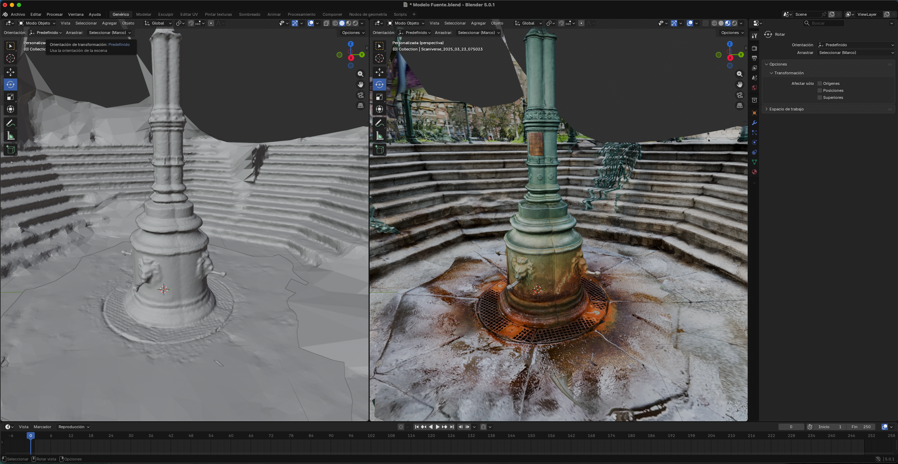
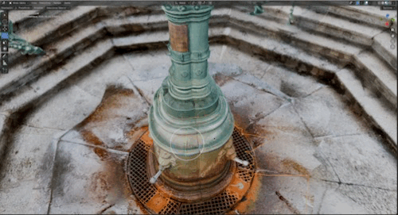
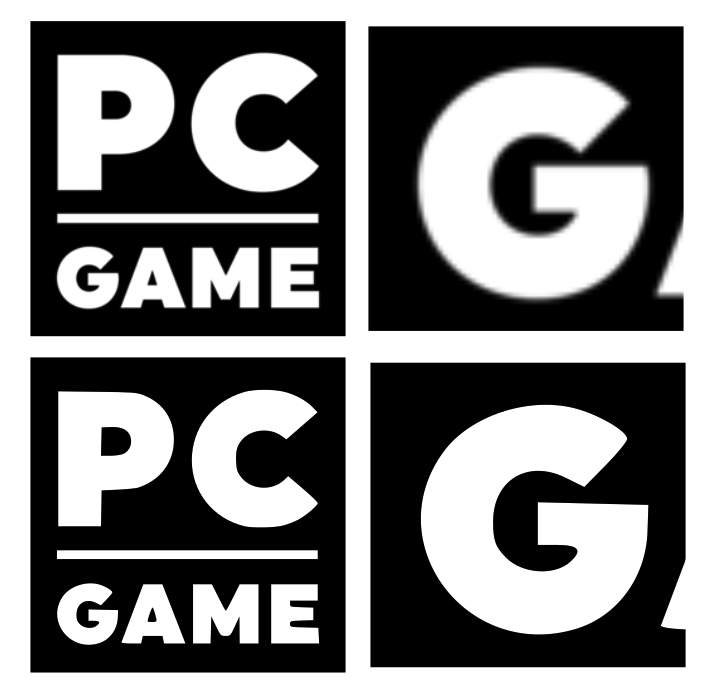

# PEC3: Visionando el futuro con las gafas de Manovich 

### Recurso de aprendizaje de Cultura Digital 

Autor: Víctor Núñez Sánchez

Fecha: Mayo 2026

## Planteamiento

En la obra de Lev Manovich, que estamos analizando este semestre <i>El sofware toma el mando</i> (2013), nos adentramos en esta PEC en la hibridación. Hemos visto como en la multimedia se han re-mediado los medios tradicionales mediante una simulación digital, pero superada esa fase, nos adentramos en la evolución de los medios. Una evolución en la que "Se fusionan para ofrecer una experiencia nueva y coherente, que es distinto a experimentar los elementos uno por uno” **(Manovich, 2013)**, la hibridación. Y como bien nos indica Manovich, esta hibridación no se trata de tomar varios medios por separado, sino que es la fusión de distintos medios para formular algo distinto que funciona como un conjunto.

En este ensayo vamos a analizar dos casos, el primero es una app(Scaniverse) y el segundo, una herramienta dentro de una aplicación (Vectorizar mapa de bits)
 

## Re-descubriendo la hibridacion: Caso 1 - Scaniverse

Desarrollado por <a href="https://www.nianticspatial.com/">Niantic</a>, Scaniverse es una herramienta desarrollada para Android e iOS, que mediante el uso del sensor <abbr title="Light Detection and Ranging">LiDAR</abbr>, si está disponible en el dispositivo, o con fotogrametría, es capaz de generar un objeto en 3D y aplicar imágenes en la textura del mismo

<figure>
  
  <figcaption><i>Fig1. Malla generada por Scaniverse sin textura en la mitad izquierda y con textura en la mitad derecha</i></figcaption>
</figure>

Creo que este es un caso de hibridación en el que se ve de forma muy clara, no tenemos un escaner láser de un objeto o imágenes del mismo, en archivos jpg independientes unos de otros, nos encontramos con una herramienta que nos toma como parte dentro del proceso. Como usuarios, elegimos que elemento queremos trasladar al entorno digital.
Nos ponemos a ello y en tiempo real, a través de la pantalla del dispositivo vemos como se va creando la malla sobre el elemento, siendo nosotros mismos los que decidimos si es necesario estar mas o menos tiempo para capturar mejores detalles, al crearse una malla de mayor densidad por el aumento de la cantidad de datos recogidos.

Tras la captura, decidimos dentro de unos varias configuraciones por defecto, como se van a procesar los datos, si con mayor cantidad de detalles para objetos pequeños o si se trata de un entorno algo mayor, hace un procesado para grandes superficies. Tras unos instantes, podemos visualizar nuestro trabajo en la misma aplicación, pivotando sobre el objeto o acercándonos al mismo.

<figure>
  
  <figcaption><i>Fig2. Manipulación de la cámara sobre el objeto, con renderizado en tiempo real</i></figcaption>
</figure>

Pero esta aplicación no se queda aquí. Ya que no se trata solo de una app que se use solo para escanear, le puedes dar un uso más lúdico, y es el de visitar distintas partes del mundo, donde verás los modelos que ha compartido la comunidad. Al tratarse de otro módulo dentro de la misma aplicación que es independiente a que hayas realizado escaneos o no, podríamos analizar este módulo de forma independiente, entendiendo que "la hibridación se produce en la interfaz de usuario y las herramientas que facilita el proyecto, servicio o aplicación para trabajar con ese tipo de medios” **(Manovich, 2013)**, ya que por un lado, contamos con objetos en 3D y por otro, un globo terraqueo por el que podemos navegar, que mediante esta hibridación la aplicación nos permirte viajar por recreaciones digitales por todo el mundo, que se puede convertir en totalmente inmersivo si se usa un casco VR.

## Re-descubriendo la hibridacion: Caso 2 - Vectorización de mapa de bits

<figure>
  
  <figcaption><i>Fig3. Diferencia entre mapa de bits y vector</i></figcaption>
</figure>

“No todos los híbridos tienen por qué ser elegantes, convincentes o futuristas” **(Manovich, 2013)**.
Comienzo con esta frase de Manovich, ya que creo que he elegido para este caso algo muy poco llamativo.

Pero la elección de esta herramienta específica, es que detrás de su sencillez, personalmente me ha ahorrado infinidad de horas. En un momento de mi vida, posiblemente por la crisis de los 30 y/o el deseo de crecimiento profesional que no se me permitía, al trabajar en una multinacional y pertenecer a la clase operaria, me hicieron pensar que sería una gran idea convertirme en autónomo (en pluriactividad) y dedicarme a fabricar <i>cake toppers</i>.

Esa fase, que duró un par de años, ya pasó. Ahora me encuentro en otra, que supongo que podéis deducir al leer estas líneas.

Centrándonos en el caso que nos trae aquí, hablemos de cómo esta funcionalidad, dentro de los programas de diseño vectorial, es un caso claro de hibridación.

Partimos de dos elementos. El mapa de bits, que se trata de la re-mediación de la fotografía y el objeto vectorial, que nació de la era digital y del **"metamedio"** ordenador, ya que aunque se pudieran considerar ciertos dibujos técnicos como diseño vectorial, todas las propiedades que convierten al vector en lo que es, provienen de la creación de este medio en el entorno digital.

Voy a explicar el funcionamiento de la herramienta. Tras insertar un mapa de bits, seleccionamos ciertos parámetros de configuración 

Llegados a este punto se podría plantear la siguiente duda. Si el objeto resultante es un vector, estructuralmente idéntico a cualquier otro que se crea desde cero ¿Realmente estamos hablando de hibridación?

Habiendo analizado a los dos protagonistas de este caso, entendemos que la herramienta se trata de un caso de hibridación, ya que tomamos el ADN de estos dos elementos y creamos algo nuevo, que en la parte visual conseva la esencia de un mapa de bits, pero que en su interior, tiene una estructura vectorial.

### Referencias y Bibliografía

* Manovich, Lev. (2013). **El Software toma el mando**. Barcelona: Editorial UOC. 

----

Licencia: Material Creative Commons desarrollado bajo licencia CC BY-SA 4.0. 
